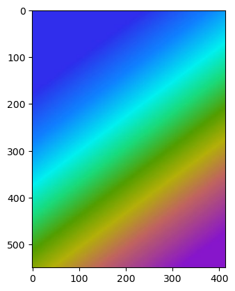
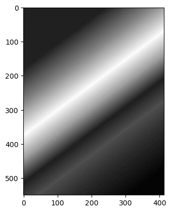
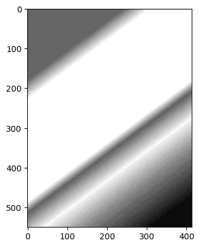
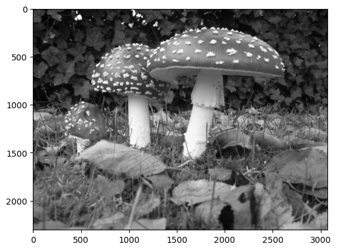
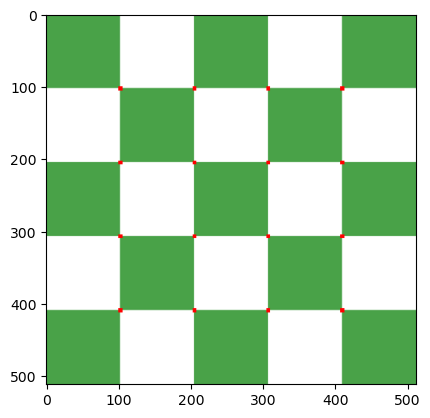

```python
import cv2
import numpy as np
import matplotlib.pyplot as plt
```


```python
img = cv2.imread('Mushroom.jpg')
plt.imshow(img) #here we are not concerned about image color change as we are performing edge detection
```


    <matplotlib.image.AxesImage at 0x216a6d6efd0>


    

    


```python
edges = cv2.Canny(image=img,
                  threshold1=127,
                  threshold2=127) #setting both threshold as median values
plt.imshow(edges)
```


    <matplotlib.image.AxesImage at 0x216a6de4e10>


    

    


```python
med_value = np.median(img)
med_value

#lower and upper limit of threshold

lower = int(max(0,0.7*med_value)) #lower threshold = 0 or 70% of median value whichever is greater
upper = int(min(255,1.3*med_value)) #upper threshold is 30% above threshold or 255 whichever is smaller
```


```python
edges = cv2.Canny(image=img,
                  threshold1=lower,
                  threshold2=upper)
plt.imshow(edges)
```


    <matplotlib.image.AxesImage at 0x216a751ae90>


    

    


```python
edges = cv2.Canny(image=img,
                  threshold1=lower,
                  threshold2=upper+100)
plt.imshow(edges)
```


    <matplotlib.image.AxesImage at 0x216a7598cd0>


    

    


```python
blurred_img = cv2.blur(img,ksize=(5,5))

edges = cv2.Canny(image=blurred_img,
                  threshold1=lower,
                  threshold2=upper)
plt.imshow(edges)
```


    <matplotlib.image.AxesImage at 0x216a2f72c10>


    

    


```python

```
