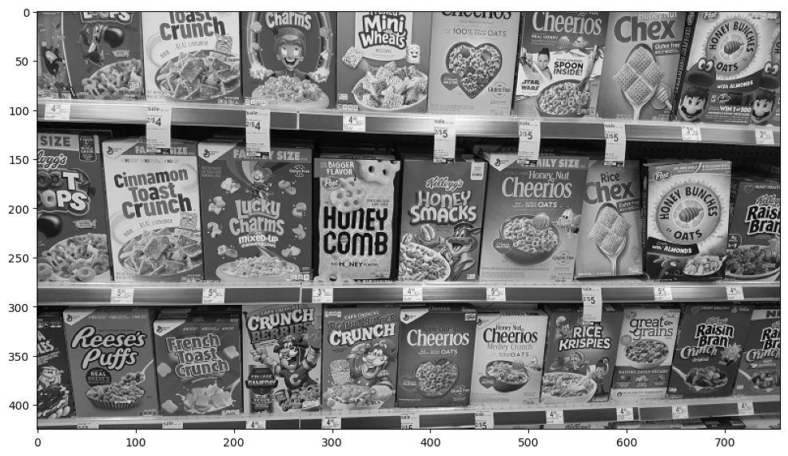
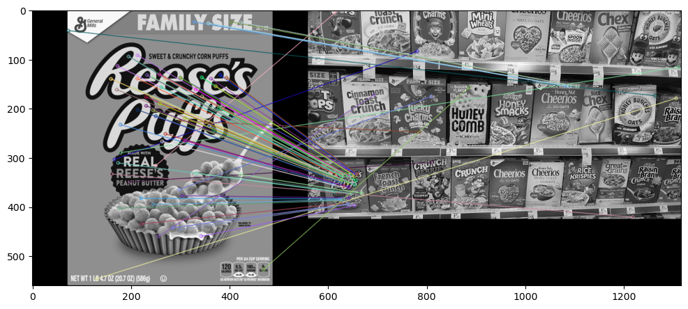
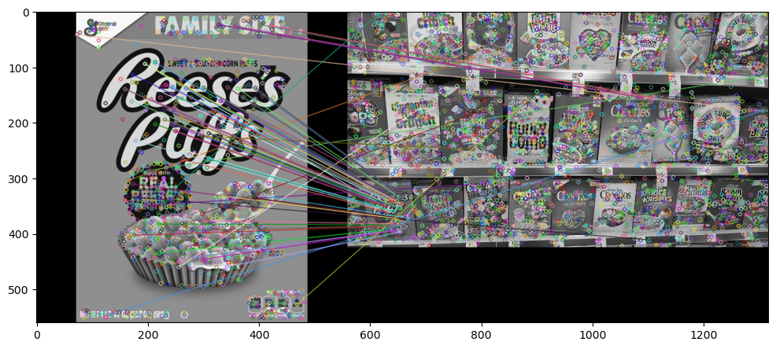
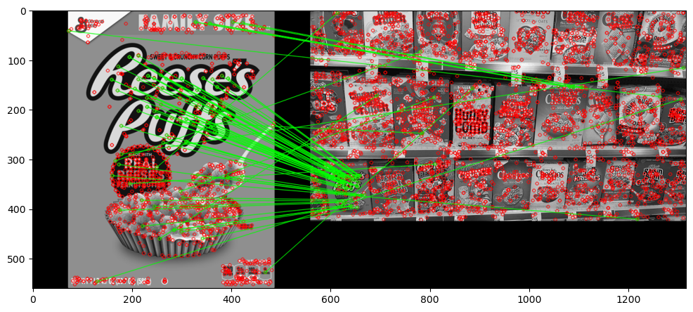

# Feature Detection
## Feature Matching
```python
import cv2
import numpy as np
import matplotlib.pyplot as plt
```


```python
def display(img, cmap='gray'):
    # Display an image using Matplotlib
    fig = plt.figure(figsize=(12, 10))
    ax = fig.add_subplot(111)
    ax.imshow(img, cmap=cmap)
    plt.show()
```


```python
# Load images in grayscale
reeses = cv2.imread('reeses_puffs.png', 0)
display(reeses)
```


    

    


```python
cereals = cv2.imread('many_cereals.jpg', 0)
display(cereals)
```


    

    


```python
# Create ORB detector
orb = cv2.ORB_create()
```


```python
# Detect keypoints and descriptors using ORB
kp1, des1 = orb.detectAndCompute(reeses, mask=None)
kp2, des2 = orb.detectAndCompute(cereals, mask=None)
```


```python
# Match descriptors using Brute Force Matcher
bf = cv2.BFMatcher(cv2.NORM_HAMMING, crossCheck=True)
matches = bf.match(des1, des2)  # Match descriptors
```


```python
# Sort matches based on distance
matches = sorted(matches, key=lambda x: x.distance)
```


```python
# Draw top 25 matches
reeses_matches = cv2.drawMatches(reeses, kp1, cereals, kp2, matches[:25], None, flags=2)
display(reeses_matches)
```


    

    


```python
# Create SIFT detector (corrected)
sift = cv2.SIFT_create()
```


```python
# Detect keypoints and descriptors using SIFT
kp1, des1 = sift.detectAndCompute(reeses, None)
kp2, des2 = sift.detectAndCompute(cereals, None)
```


```python
# Create SIFT detector (corrected)
sift = cv2.SIFT_create()
```


```python
# Detect keypoints and descriptors using SIFT
kp1, des1 = sift.detectAndCompute(reeses, None)
kp2, des2 = sift.detectAndCompute(cereals, None)
```


```python
bf = cv2.BFMatcher()
matches = bf.knnMatch(des1,des2,k=2)
```


```python
good =[]
# LESS DISTANCE -- BETTER THE MATCH
for match1,match2 in matches:
  #if MATCH1 DISTANCE is < 75% of MATCH 2 THEN IT IS A GOOD MATCH
  if match1.distance < 0.75*match2.distance:
    good.append([match1])
```


```python
print('Length of total matches: ',len(matches))
```

    Length of total matches:  1501
    


```python
print('Length of good matches: ',len(good))
```

    Length of good matches:  79
    


```python
sift_matches = cv2.drawMatchesKnn(reeses,kp1,cereals,kp2,good,None,flags=2)
display(sift_matches)
```


    

    


```python
# Initialize the SIFT detector
sift = cv2.SIFT_create()
```


```python
# Detect keypoints and descriptors in both images
kp1, des1 = sift.detectAndCompute(reeses, None)
kp2, des2 = sift.detectAndCompute(cereals, None)
```


```python
flann_index_KDtree = 0
index_params = dict(algorithm=flann_index_KDtree,trees=5)
search_params = dict(checks=50)
```


```python
flann = cv2.FlannBasedMatcher(index_params,search_params)

matches = flann.knnMatch(des1,des2,k=2)
```


```python
good =[]
# LESS DISTANCE -- BETTER THE MATCH
for match1,match2 in matches:
  #if MATCH1 DISTANCE is < 75% of MATCH 2 THEN IT IS A GOOD MATCH
  if match1.distance < 0.75*match2.distance:
    good.append([match1])
```


```python
flann_matches = cv2.drawMatchesKnn(reeses,kp1,cereals,kp2,good,None,flags=0)
display(flann_matches)
```


    

    


```python
#with mask

sift = cv2.SIFT_create()

kp1,des1 = sift.detectAndCompute(reeses,None)
kp2,des2 = sift.detectAndCompute(cereals,None)

flann_index_KDtree = 0
index_params = dict(algorithm=flann_index_KDtree,trees=5)
search_params = dict(checks=50)

flann = cv2.FlannBasedMatcher(index_params,search_params)

matches = flann.knnMatch(des1,des2,k=2)
```


```python
#masking
matchesMask = [[0,0] for i in range(len(matches))] #bunch of zeros pure black and some will be on

# LESS DISTANCE -- BETTER THE MATCH
for i,(match1,match2) in enumerate(matches):
  #if MATCH1 DISTANCE is < 75% of MATCH 2 THEN IT IS A GOOD MATCH
  if match1.distance < 0.75*match2.distance:
    matchesMask[i] = [1,0]

draw_params = dict(matchColor=(0,255,0),
                   singlePointColor=(255,0,0),
                   matchesMask=matchesMask,
                   flags=0) #by changing flags = 2 we can remove the red dots

flann_matches = cv2.drawMatchesKnn(reeses,kp1,cereals,kp2,matches,None,**draw_params)
display(flann_matches)
```


    

    


```python

```
