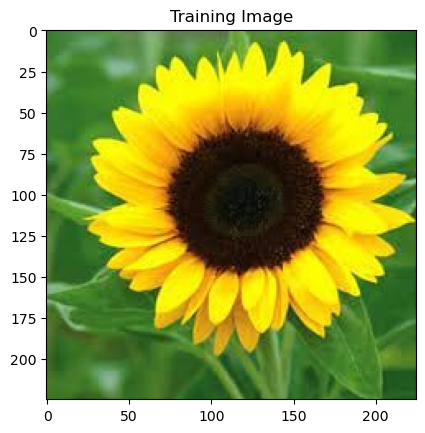
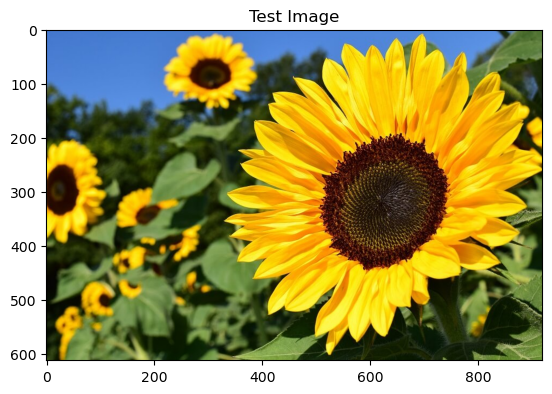
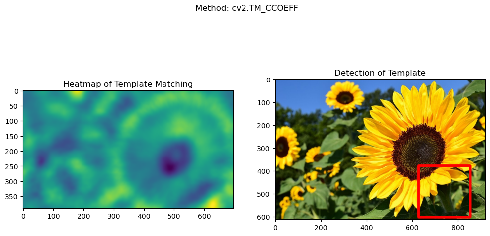
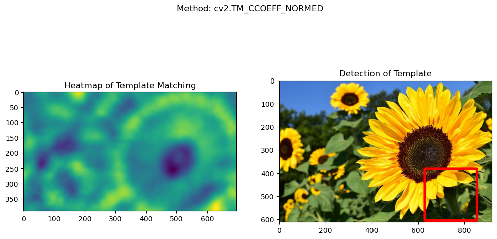
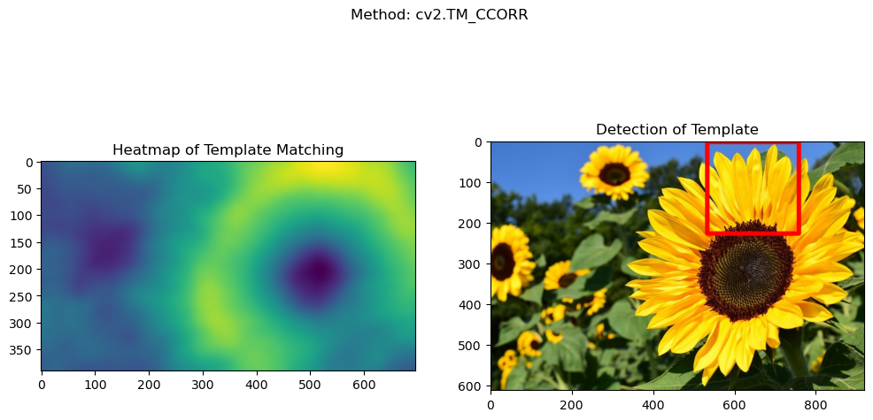
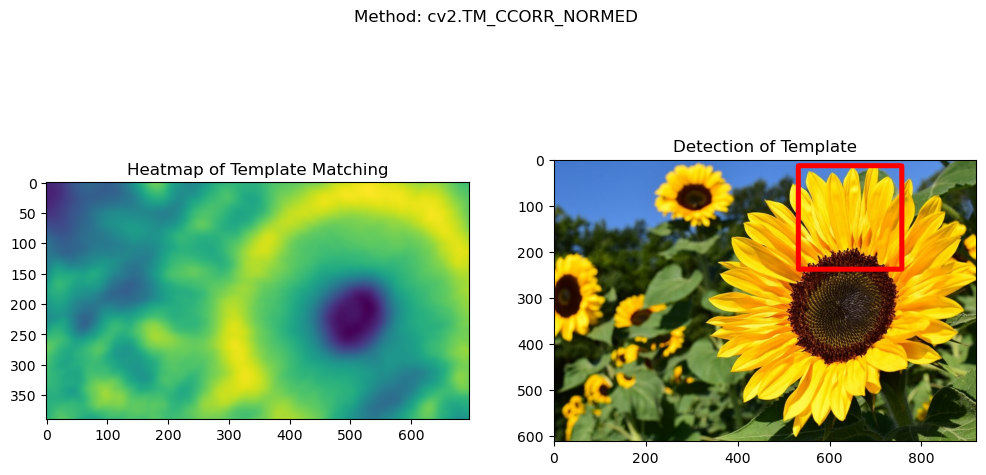
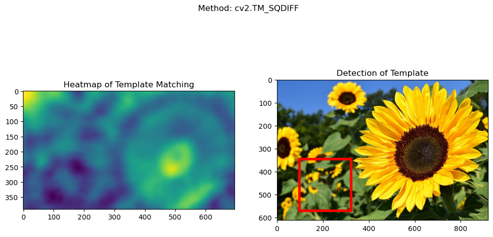
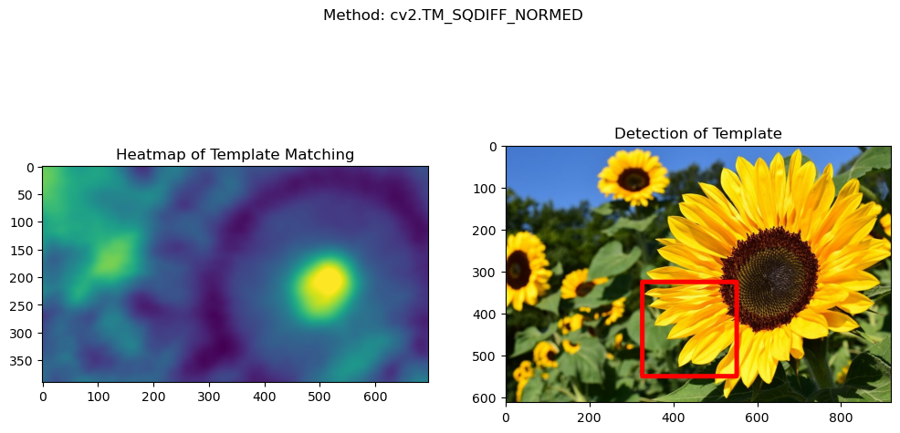

# Feature Detection
## Object Detection
```python
import cv2
import numpy as np
import matplotlib.pyplot as plt
```


```python
full = cv2.imread('Training_Sunflower.jpg')
full = cv2.cvtColor(full, cv2.COLOR_BGR2RGB)  # Convert to RGB for visualization
plt.imshow(full)
plt.title("Training Image")
plt.show()
```


    

    


```python
test = cv2.imread('Sunflower_Testing.jpg')
test = cv2.cvtColor(test, cv2.COLOR_BGR2RGB)  # Convert to RGB for visualization
plt.imshow(test)
plt.title("Test Image")
plt.show()
```


    

    


```python
# Print image shapes
print('Test image shape: ', test.shape)
```

    Test image shape:  (613, 920, 3)
    


```python
print('Training image shape: ', full.shape)
```

    Training image shape:  (225, 225, 3)
    


```python
# Methods for template matching
methods = ['cv2.TM_CCOEFF', 'cv2.TM_CCOEFF_NORMED', 'cv2.TM_CCORR', 'cv2.TM_CCORR_NORMED', 'cv2.TM_SQDIFF', 'cv2.TM_SQDIFF_NORMED']
```


```python
for m in methods:
    test_copy = test.copy()  # Copy test image to draw rectangles on
    method = eval(m)  # Evaluate the method string to the actual OpenCV method
    
    # Apply template matching
    res = cv2.matchTemplate(test_copy, full, method)
    
    # Get the minimum and maximum values of the result
    min_val, max_val, min_loc, max_loc = cv2.minMaxLoc(res)

    # Choose the top left corner based on the method
    if method in [cv2.TM_SQDIFF, cv2.TM_SQDIFF_NORMED]:
        top_left = min_loc
    else:
        top_left = max_loc

    # Get the dimensions of the template image
    height, width, channels = full.shape
    bottom_right = (top_left[0] + width, top_left[1] + height)

    # Draw a rectangle on the test image to indicate the match
    cv2.rectangle(test_copy, top_left, bottom_right, (255, 0, 0), 10)  # Red rectangle

    # Plot the result: heatmap of the matching and the test image with detection
    plt.figure(figsize=(12, 6))  # Adjust the size for better visualization
    plt.subplot(121)
    plt.imshow(res)  # Heatmap of template matching
    plt.title("Heatmap of Template Matching")
    plt.subplot(122)
    plt.imshow(test_copy)  # Image with detected rectangle
    plt.title('Detection of Template')
    plt.suptitle(f'Method: {m}')  # Display the method name on top of the images
    plt.show()

    print('\n')
```


    

    


    
    
    


    

    


    
    
    


    

    


    
    
    


    

    


    
    
    


    

    


    
    
    


    

    


    
    
    


```python

```
