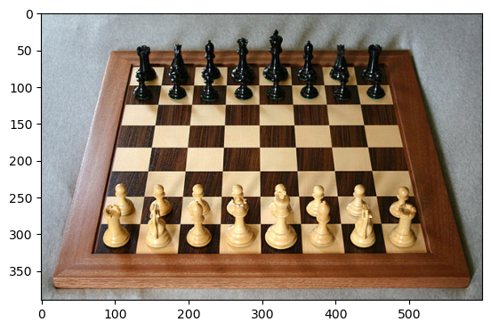
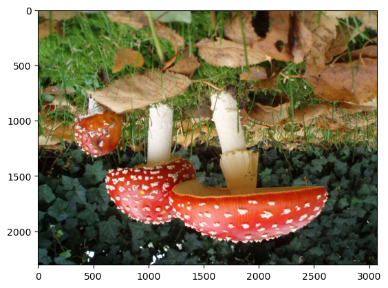
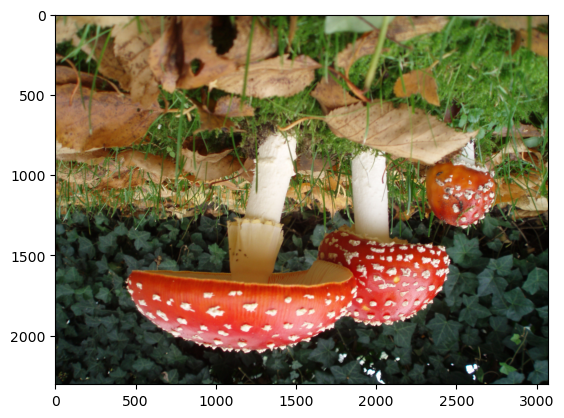
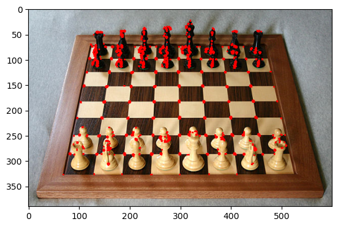
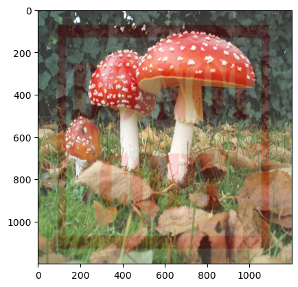
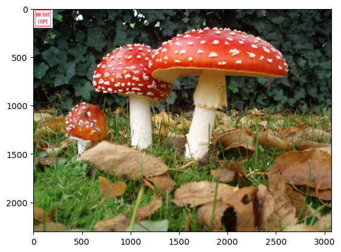

# OpenCV
## Part 2
```python
import cv2
import matplotlib.pyplot as plt
```


```python
img = cv2.imread("Mushroom.jpg")

plt.imshow(img)
```


    <matplotlib.image.AxesImage at 0x1ad0bc99160>


    

    


```python
img1 = cv2.cvtColor(img, cv2.COLOR_BGR2RGB)

plt.imshow(img1)
```


    <matplotlib.image.AxesImage at 0x1ad0cd2a0d0>


    

    


```python
img2 = cv2.cvtColor(img, cv2.COLOR_BGR2HSV)

plt.imshow(img2)

```


    <matplotlib.image.AxesImage at 0x1ad0cdbca50>


    

    


```python
img3 = cv2.cvtColor(img, cv2.COLOR_BGR2HLS)

plt.imshow(img3)
```


    <matplotlib.image.AxesImage at 0x1ad0ce32ad0>


    

    


```python
img1 = cv2.imread('do-not-copy-stamp.jpg')
img2 = cv2.imread("Mushroom.jpg")

plt.imshow(img1)
```


    <matplotlib.image.AxesImage at 0x1ad17a0c910>


    

    


```python
img1 = cv2.cvtColor(img1, cv2.COLOR_BGR2RGB)
img2 = cv2.cvtColor(img2, cv2.COLOR_BGR2RGB)
```


```python
plt.imshow(img1)
```


    <matplotlib.image.AxesImage at 0x1ad110b0b90>


    

    


```python
plt.imshow(img2)
```


    <matplotlib.image.AxesImage at 0x1ad11158050>


    

    


```python
img1 = cv2.resize(img1, (1200,1200))
img2 = cv2.resize(img2, (1200, 1200))

alpha = 0.5
beta = 0.5

blended = cv2.addWeighted(img1, alpha, img2, beta, gamma=0)

plt.imshow(blended)
```


    <matplotlib.image.AxesImage at 0x1ad1373de50>


    

    


```python
alpha = 0.8
beta = 0.2

blended1 = cv2.addWeighted(img1, alpha, img2, beta, 0)
plt.imshow(blended1)
```


    <matplotlib.image.AxesImage at 0x1ad1378fc50>


    

    


```python
alpha = 0.2
beta = 0.8

blended1 = cv2.addWeighted(img1, alpha, img2, beta, 0)
plt.imshow(blended1)
```


    <matplotlib.image.AxesImage at 0x1ad13825a90>


    

    


```python
img1 = cv2.imread('do-not-copy-stamp.jpg')
img2 = cv2.imread('Mushroom.jpg')
```


```python
img1 = cv2.cvtColor(img1, cv2.COLOR_BGR2RGB)
img2 = cv2.cvtColor(img2, cv2.COLOR_BGR2RGB)
```


```python
img1 = cv2.resize(img1, (200,200))

large_img = img2
small_img = img1

x_offset = 0
y_offset = 0

x_end = x_offset + small_img.shape[1]
y_end = y_offset + small_img.shape[0]

large_img[y_offset:y_end, x_offset:x_end] = small_img

plt.imshow(large_img)
```


    <matplotlib.image.AxesImage at 0x1ad111e7890>


    

    


```python

```
