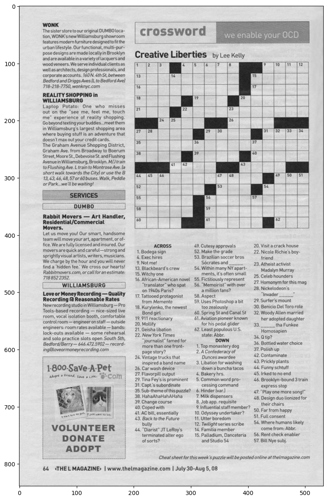
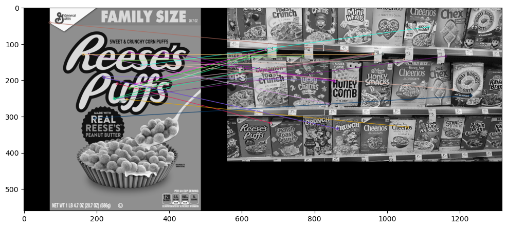
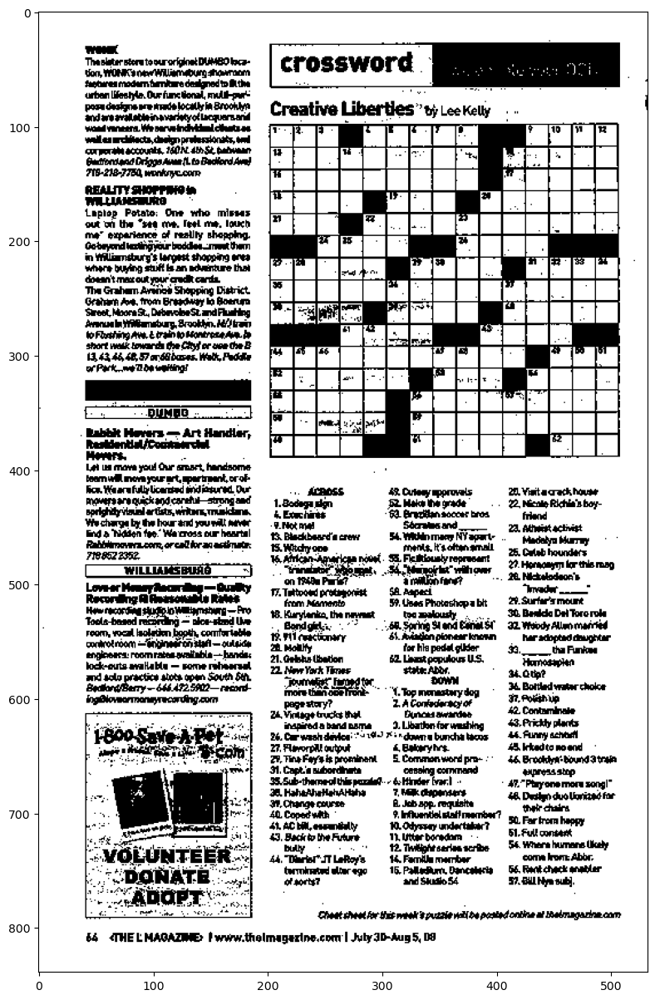
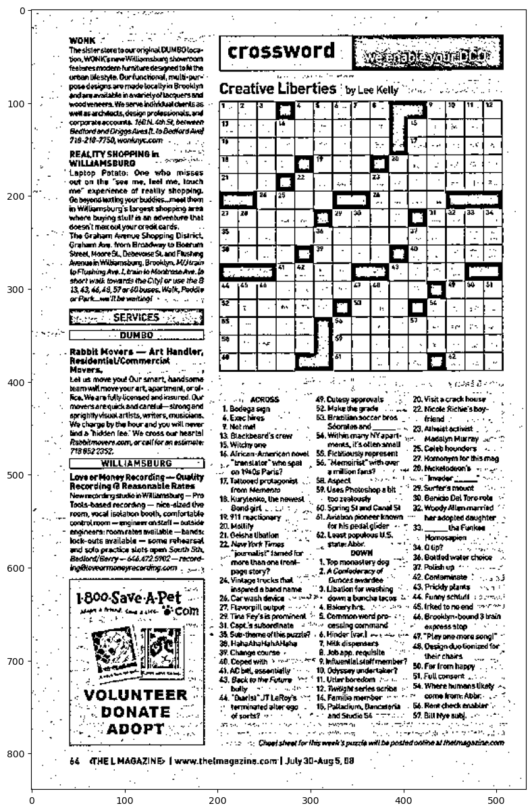

# OpenCV
## Part 3
```python
import cv2
import matplotlib.pyplot as plt
```


```python
img = cv2.imread('rainbow.jpg')
plt.imshow(img)
```


    <matplotlib.image.AxesImage at 0x1eea6611160>


    

    


```python
img = cv2.imread('rainbow.jpg', 0)
plt.imshow(img, cmap = 'gray')
```


    <matplotlib.image.AxesImage at 0x1eea80d25d0>


    

    


```python
ret1, thresh1 = cv2.threshold(img, 127, 255, cv2.THRESH_BINARY)

ret1
thresh1

plt.imshow(thresh1, cmap = 'gray')
```


    <matplotlib.image.AxesImage at 0x1eea8144a50>


    

    


```python
img2 = cv2.imread('rainbow.jpg', 0)
ret1, thresh1 = cv2.threshold(img2, 127, 255, cv2.THRESH_TRUNC)
plt.imshow(thresh1, cmap = "gray")
```


    <matplotlib.image.AxesImage at 0x1eea92be350>


    

    


```python
img3 = cv2.imread('rainbow.jpg', 0)
ret1, thresh1 = cv2.threshold(img3, 127, 255, cv2.THRESH_TOZERO)
plt.imshow(thresh1, cmap = "gray")
```


    <matplotlib.image.AxesImage at 0x1eea930f9d0>


    

    


```python
img_r = cv2.imread('crossword.jpg', 0)
plt.imshow(img_r, cmap = 'gray')
```


    <matplotlib.image.AxesImage at 0x1eeae4e4190>


    

    


```python
def show_pic(img):
    fig = plt.figure(figsize = (15,15))
    ax = fig.add_subplot(111)
    ax.imshow(img, cmap = 'gray')

show_pic(img_r)
```


    

    


```python
ret, th1 = cv2.threshold(img_r, 127, 255, cv2.THRESH_BINARY)
show_pic(th1)
```


    

    


```python
ret, th1 = cv2.threshold(img_r, 200, 255, cv2.THRESH_BINARY)
show_pic(th1)
```


    

    


```python
th2 = cv2.adaptiveThreshold(img_r, 255, cv2.ADAPTIVE_THRESH_MEAN_C, cv2.THRESH_BINARY, 11, 8)
show_pic(th2)
```


    

    


```python
blended = cv2.addWeighted(src1 = th1, alpha = 0.6,
                          src2 = th2, beta = 0.4, gamma = 0)

show_pic(blended)
```


    

    


```python
th3 = cv2.adaptiveThreshold(img_r, 255, cv2.ADAPTIVE_THRESH_MEAN_C, cv2.THRESH_BINARY, 11, 8)

blended = cv2.addWeighted(src1=th1, alpha=0.6,
                          src2=th2, beta=0.4, gamma=0)

show_pic(blended)
```


    

    


```python

```
